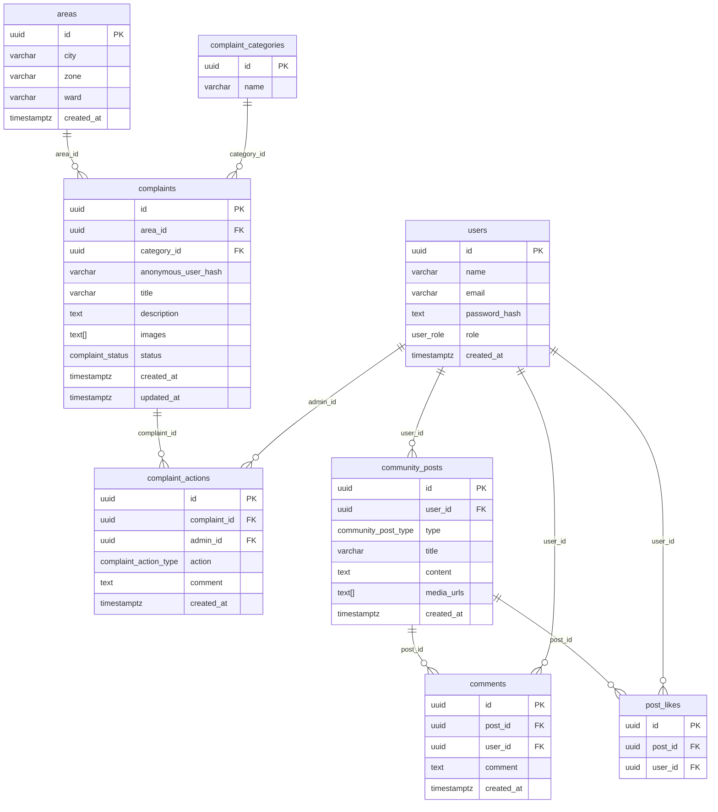

# 01.4 ERD (conceptual)

This ERD matches `01-schema.sql`.

```mermaid
erDiagram
  users {
    uuid id PK
    varchar name
    varchar email
    text password_hash
    user_role role
    timestamptz created_at
  }

  areas {
    uuid id PK
    varchar city
    varchar zone
    varchar ward
    timestamptz created_at
  }

  complaint_categories {
    uuid id PK
    varchar name
  }

  complaints {
    uuid id PK
    uuid area_id FK
    uuid category_id FK
    varchar anonymous_user_hash
    varchar title
    text description
    text[] images
    complaint_status status
    timestamptz created_at
    timestamptz updated_at
  }

  complaint_actions {
    uuid id PK
    uuid complaint_id FK
    uuid admin_id FK
    complaint_action_type action
    text comment
    timestamptz created_at
  }

  community_posts {
    uuid id PK
    uuid user_id FK
    community_post_type type
    varchar title
    text content
    text[] media_urls
    timestamptz created_at
  }

  comments {
    uuid id PK
    uuid post_id FK
    uuid user_id FK
    text comment
    timestamptz created_at
  }

  post_likes {
    uuid id PK
    uuid post_id FK
    uuid user_id FK
  }

  areas ||--o{ complaints : area_id
  complaint_categories ||--o{ complaints : category_id
  complaints ||--o{ complaint_actions : complaint_id
  users ||--o{ complaint_actions : admin_id

  users ||--o{ community_posts : user_id
  community_posts ||--o{ comments : post_id
  users ||--o{ comments : user_id

  community_posts ||--o{ post_likes : post_id
  users ||--o{ post_likes : user_id
```
